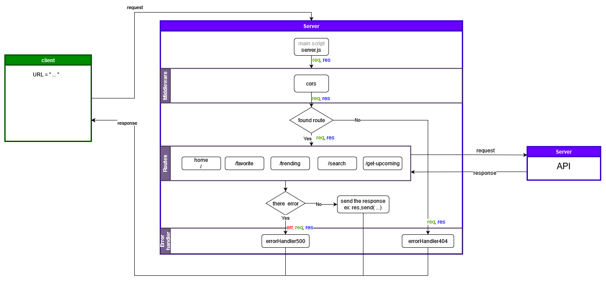

# Movie Library - 1.0.0

**Author Name**: Emam Al Mouqner

## WRRC

Web-Request-Response-Cycle





## Overview

Movie app ,server built to get movie data, built as learning project.

## Getting Started

to start run these command in you machine

- clone this repo

```sh
git clone <this repo url>
```

- go inside the repo folder

```sh
cd Movies-Library
```

- start the postgres sql server

> **_NOTE:_**  below command not for all machine, start the server as you know

```sh
sqlstart
```

- create db

```sh
createdb 'moviesLibrary'
```

- migrate  the scheme from schema file to your database

```sh
psql -d moviesLibrary -f schema.sql
```

- install packages

```sh
npm install
```

- start the server

```sh
npm start
```

## Project Features

get `movies` data in json format

---

### Get Trending movie

`http://localhost:3000/trending`

query :

- page : number

example : `http://localhost:3000/trending?page=2`

---

### Search movie

`http://localhost:3000/search`

query :

- query: string
- page : number

example : `http://localhost:3000/search?query=The&page=2`

---

### Get upcoming movie

`http://localhost:3000/get-Upcoming`

query :

- page : number

---

### Get popular actor

`http://localhost:3000/popular-actor`

query :

- page : number

---

### Get all movies from database

`http://localhost:3000/getMovies`

---

### add movie popular actor

`http://localhost:3000/popular-actor`

body :

- title : string
- release_date : string (date)
- poster_path : string
- overview : string
- comment : string

Example:

```json
{
  "title": "Emam movie",
  "release_date" : "1995-12-30",
  "poster_path" : "testpath",
  "overview" : "test overview",
  "comment" : "test comment"
}
```
